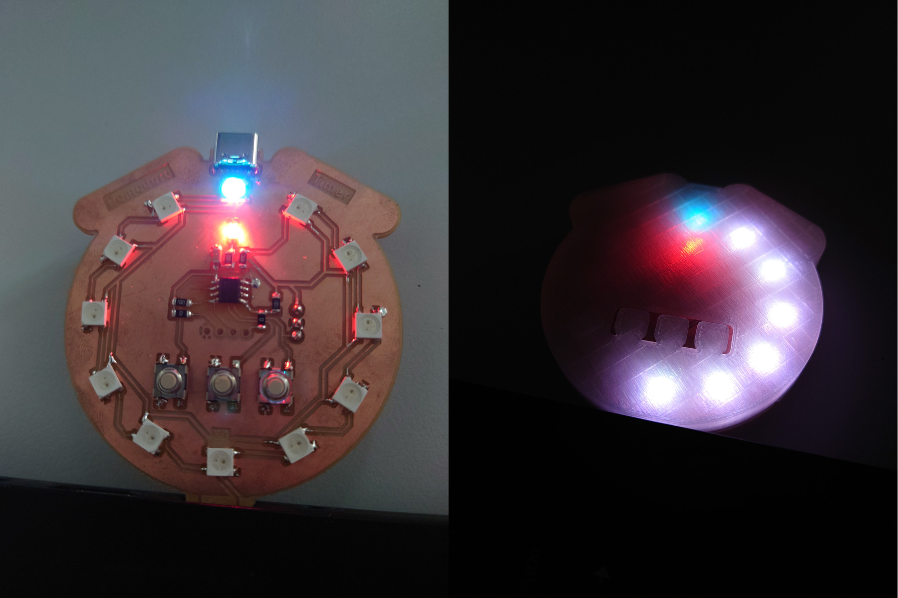

# Pomodoro Timer

A little USB A timer user for the [Pomdoro Technique](https://en.wikipedia.org/wiki/Pomodoro_Technique).

## Features

- small and powerful ATTiny412 as MCU
- 12 WS2813B RGB LEDs
- 3 Buttons
- I2C Header for playing around
- power over USB C or integrated USB A connector

## Structure

`pcb/`
: KiCAD Files for the electronic schematics and the routed layout

`code/`
: Arduino Code for a simple implementation of the pomodoro technique

`housing/`
: FreeCAD Model for a simple housing for the board

`doc/`
: Datasheets

## Dependencies

### Hardware

- [Components Library](https://gitlab.fabcloud.org/pub/libraries/electronics/kicad) - Component library used for the PCB
- [Serial D11C Programmer](https://gitlab.fabcloud.org/pub/programmers/programmer-serial-d11c) - UPDI Programmer used for flashing together with this [adapter](https://leomcelroy.com/svg-pcb/?file=hello.serial-UPDI.3.js), but also possible with e.g.:
    - [SWD+UART Board](https://gitlab.fabcloud.org/pub/programmers/swd-uart-adapter-xiao-rp2040)
    - [UPDI D11C](https://gitlab.fabcloud.org/pub/programmers/programmer-updi-d11c)
- [MegaTinyCore](https://github.com/SpenceKonde/megaTinyCore/) - arduino library used for programming the ATTiny412
- an arduino environment, more in [here](/code/README.md)
- [KiCAD](https://www.kicad.org/) for editing the PCB/ creating other production files
- [FreeCAD](https://www.freecad.org/) for editing the housing

## BOM Components

| Designator                              | Footprint                                   | Quantity | Designation                 |
|-----------------------------------------|---------------------------------------------|----------|-----------------------------|
| U6,U8,U3,U9,U11,U10,U2,U12,U4,U7,U5,U13 | LED_ADDR_Worldsemi_WS2812B                  | 12       | WS2812B                     |
| R2,R7                                   | R_1206                                      | 2        | 0R                          |
| J2                                      | PinHeader_01x04_P2.54mm_Vertical_THT_D1.4mm | 1        | I2C Header                  |
| P1                                      | Conn_USB_A_Plain                            | 1        | Conn_USB_A_Plain            |
| C3                                      | C_1206                                      | 1        | 100nF                       |
| R3                                      | R_1206                                      | 1        | 100R                        |
| SW3                                     | Button_Omron_B3SN_6.0x6.0mm                 | 1        | Restart                     |
| R6,R1                                   | R_1206                                      | 2        | 1kR                         |
| D4                                      | LED_1206                                    | 1        | Power LED                   |
| SW1                                     | Button_Omron_B3SN_6.0x6.0mm                 | 1        | Start/Stop                  |
| U1                                      | SOIC-8_3.9x4.9mm_P1.27mm                    | 1        | ATtiny412                   |
| J1                                      | PinHeader_01x03_P2.54mm_Vertical_THT_D1.4mm | 1        | UPDI Flash Header           |
| J3                                      | Conn_USB_C_Socket_GCT_USB4125-GF-A-0190     | 1        | Conn_USB_C_Socket_PowerOnly |
| R5                                      | R_1206                                      | 1        | 499R                        |
| SW2                                     | Button_Omron_B3SN_6.0x6.0mm                 | 1        | Skip                        |

