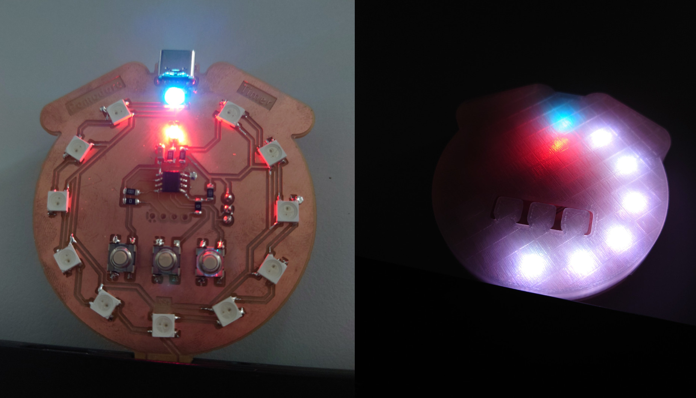

# Pomodoro Timer

A little USB A timer user for the [Pomdoro Technique](https://en.wikipedia.org/wiki/Pomodoro_Technique).

## Features

- small and powerful ATTiny412 as MCU
- 12 WS2813B RGB LEDs
- 3 Buttons
- I2C Header for playing around
- power over USB C or integrated USB A connector

## Structure

`pcb/`
: KiCAD Files for the electronic schematics and the routed layout

`code/`
: Arduino Code for a simple implementation of the pomodoro technique

`housing/`
: FreeCAD Model for a simple housing for the board

`doc/`
: Datasheets
