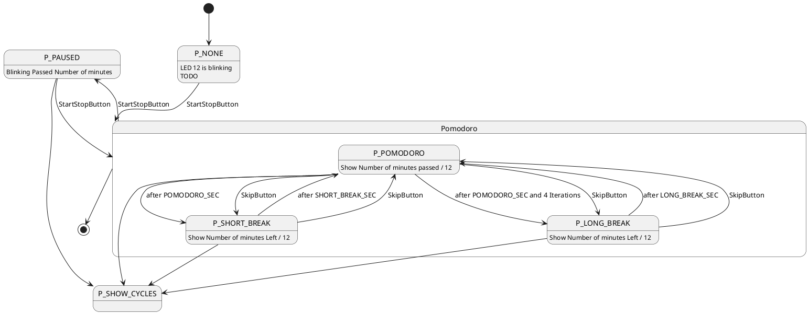

# Simple implementation of the Pomodoro timer in Arduion

- Initial '12' cycles colors

## Buttons:

| Button | Function | 
| ------ | -------- |
| Restart (right)| Cancels the Current Routine and Starts again |
| Start/Stop (middle)| Toggles running of the current round (pause or productivity time) |
| Skip (left) | Skips the currently running cycle|

## Structure



- use the [`conf.h`](./conf.h) file to adjust the programms behavior

## Compile and Upload

### Dependencies

- [Arduino](https://www.arduino.cc/en/software/), ether
    - IDE (recommended: v1/legacy, but the newer one should also work)
    - arduino-cli
- [MegaTinyCore](https://github.com/SpenceKonde/megaTinyCore/) for the core implementation of the arduino API for the [ATtiny412](https://github.com/SpenceKonde/megaTinyCore/blob/master/megaavr/extras/ATtiny_x12.md)

### arduino-cli

0. Install the arduino-cli

1. First you need to setup your Arduino environment:

``` bash
# initialises the system configuration for arduino
# usually at '$HOME/.arduino15/' where 15 represents the version
arduino-cli config init
```

2. Next you need to download the core library

``` bash
# add the index from the MegaTinyCore index
arduino-cli config add board_manager.additional_urls http://drazzy.com/package_drazzy.com_index.json

# now install the megaTinyCore library
arduino-cli core install megaTinyCore:megaavr
```

3. Now compile like this:

``` bash
# compile with megaTinyCore for attiny412(atxy2) (or attiny212)
arduino-cli compile --fqbn megaTinyCore:megaavr:atxy2 code.ino
```

4. And then to upload it with the [Serial D11C Programmer](https://gitlab.fabcloud.org/pub/programmers/programmer-serial-d11c) (and [this adapter](https://leomcelroy.com/svg-pcb/?file=hello.serial-UPDI.3.js)) use this:

``` bash
# upload with the flasher on port '/dev/ttyACM0' for the attiny412 (atxy2) and the flasher is a 'serialupdi57k' (57000 Baudrate)
arduino-cli upload -p /dev/ttyACM0 --fqbn megaTinyCore:megaavr:atxy2 -P serialupdi57k code.ino
```

### Arduion IDE 1.X

TODO
